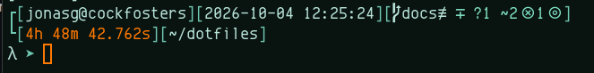
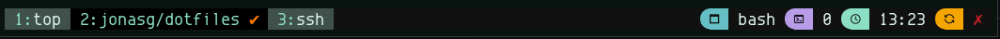

# INFO ... all the stuff ...

A quick reference to what's in this repo. These days I run my daily driver on 
Arch Linux.

---

## Dependencies

Below is a list of package names for Arch Linux that need to be manually 
installed. As in these are not dependencies of other packages. Some of these 
may be AUR packages. Other distros may use different names. 

### CLI

```
# pacman -S \
    7zip bash bash-completion cabextract cpio curl dhcpcd eza \
    fastfetch fd gnupg htop inxi lshw mg most ncdu net-tools \
    netcat netstat rar ripgrep rlwrap rsync sox ss sudo tmux \ 
    tree unzip wget zip
```

### GUI

```
# pacman -S alacritty nerd-fonts oh-my-posh rxvt-unicode xclip \
    xterm
```

### Development

```
# pacman -S \
    ansible base-devel chez-scheme chicken clang colordiff diffutils \
    emacs gambit git guile hugo ipython jdk jq llvm meld mercurial \
    python sbcl yq
```

--- 

## Shell

The shell I use is `bash` and everything is optimized for it.

### Navigation

| Alias | Purpose |
|---|---|
| `..`, `.2` ... `.5` | Go up 1 up to 5 directories |
| `back` | jump back to the previous directory using `$OLDPWD` |
| `pu` | `pushd` Add directories to stack |
| `po` | `popd` Remove directories from stack |
| `cdl` | `cd` into and `dir` a directory in one operation |
| `mcd` | `mkdir -p` and `cd` into a directory |
| `cd..` | `cd ..` |

### Listing

| Alias | Purpose |
|---|---|
| `ll` | list all in long format with indicators and no group |
| `l` | list in long format |
| `lr` | list recursive |
| `l.` | list all in long format with human sizes and no group and ISO time |
| `dots` | list only dotfiles |
| `dir` | use `eza` to list directory |
| `dirt` | use `eza` to list directory with a tree like recursize structure |
| `dira` | list all in long format with indicators, human sizes, and group |
| `dirr` | list all in long format with indicators, human sizes, and group, in reverse chronological order |

### Other Useful Aliases

| Alias | Purpose |
|---|---|
| `sa` | list all aliases |
| `reload` | reloads bash configuration |
| `space` | displays diska space used in the current directory using `ncdu` |
| `sysinfo` | displays system information using `inxi` |
| `ins` | install a package |
| `update` | update system |


### Functions

| Function | Purpose |
|---|---|
| `bak` | make a backup file |
| `cfiles` | counts regular files, symbolic links, and directories |
| `clean` | clean a directory by removing all temp and backup files |
| `envinfo` | display bash environment information |
| `extract` | extract archives based on extension |
| `findall` | look for something in all nooks and crannies |
| `mkpwd` | create 16 char password using `/dev/urandom` |
| `mping` | musical ping; requires the `sox` package be installed |
| `pg` | page with `most` if present, otherwise use `less` |
| `websrv` | start a simple web server in the current directory |
| `open` | open a file in its default app from the cli |


### The Prompt

My shell prompt is dinamically generated by `oh-my-posh`. Refer to the below
image. The first line displays session information, current date + time, git
repository information (when applicable), and command status information (when
available). The second line displays the last command execution time in a human
friendly format, python version and virtual environment information (when 
available), and the current path.



--- 

## Tmux

The prefix is remapped to `C-a` which feels more ergonomic to me. Mouse, 
clipboard, renaming are all turned on. Window indexing is set to base 1. 
Here are some of the important key bindings:

| Key | Purpose |
|---|---|
| `\|` | split pane horizontaly |
| `-` | split pane vertically |
| `F1` ... `F8` | select window |
| `S-Left`, `S-Right` | previous + next window |
| `C-S-Left`, `C-S-Right` | swap window left + right |
| `M-Arrows` | select pane |
| `F12` | synchronize panes |
| `r` | reload configuration |

Status bar displays window name, session name, current time, and pane 
synchronization status on the right.


